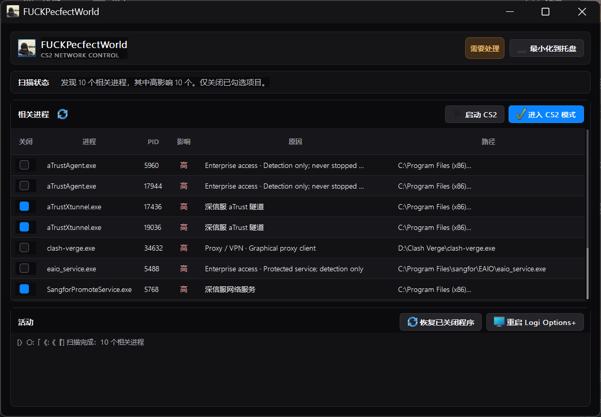

# FUCKPecfectWorld



一个 Windows Qt Widgets 小工具，用于启动 CS2 前扫描并关闭可能影响网络的程序，并在游戏结束后恢复程序或重启 Logi Options+。

## 已完成

- 扫描常见代理、VPN、深信服组件、下载器、同步盘和叠加层进程。
- 按高/中/低影响标记，用户自行勾选关闭项。
- 常见游戏加速器、Discord、Steam 叠加层默认保留，只标注风险。
- 记录本次关闭的程序，并按原始可执行文件路径恢复。
- 通过 Steam URL 启动 CS2。
- 一键停止并重新启动 Logi Options+。
- 不执行 `netsh winsock reset`，不卸载软件，不永久修改网络配置。

## 运行

直接运行 `.\bin\FUCKPecfectWorld.exe`。程序请求管理员权限，以便关闭 VPN 和网络服务进程；每次关闭都需要确认。

## 工具链和下载位置

本项目已使用 Qt 5.15.2 MinGW 8.1 64-bit 成功构建并部署运行库。

- Qt 与 MinGW 安装位置：`.\toolchain`
- 原始 Qt/MinGW `.7z` 下载归档：`.\downloads\qt-archives`
- `aqtinstall` 及依赖：`.\tools\aqtinstall`
- Python 包下载缓存：`.\downloads\pip-cache`
- 可执行程序及依赖 DLL：`.\bin`

优先尝试了清华 TUNA 镜像和中科大 USTC 镜像。TUNA 对 Qt 5.15.2 归档返回校验不一致，USTC 缺少该版本元数据，因此没有跳过哈希校验，而是回退到 Qt 官方源；官方源实际重定向到可验证镜像并完成校验。

## 重新构建

双击 `.\build_release.bat`，或在仓库根目录的命令行执行：

```bat
.\build_release.bat
```

脚本会调用项目内的 Qt/MinGW，并把 EXE 所需的 Qt DLL、MinGW 运行库及 `platforms\qwindows.dll` 更新到 `bin`。

## 安全边界

程序只终止用户勾选的进程，不修改注册表、Winsock、网卡高级属性或 Windows 服务启动类型。风险评级是经验规则，不代表某个进程一定造成延迟；加速器和 Discord 是否关闭，应按当局游戏需求自行决定。
## 界面与托盘

界面使用本地 Qt Widgets 深色主题：深色工作台、分级状态色、矢量应用图标和紧凑操作栏，不依赖第三方 UI 运行库。

- 点击窗口右上区域的最小化按钮，或 Windows 标题栏的最小化按钮，应用会隐藏到系统托盘。
- 托盘图标右键菜单提供显示主窗口、重新扫描、进入 CS2 模式、重启 Logi Options+ 和退出应用。
- 关闭窗口会询问“最小化到托盘”或“退出应用”；勾选“下次不再提醒，直接退出”后会记住该选择。
- 若要恢复退出确认，删除 Windows 用户配置中 `FUCKPecfectWorld` 的 `ui/skipExitConfirmation` 设置即可。
## 托盘与实例

应用使用原生 Windows ICO 作为 EXE、窗口和托盘图标。普通窗口最小化保留在任务栏；只有应用内的托盘按钮或关闭对话框选择“最小化到托盘”才会隐藏窗口。

程序现在限制为单实例：再次启动时会显示已运行的窗口，不会再产生看似“杀掉又复活”的重复进程。托盘图标由 Windows 管理，若未固定在任务栏中，会位于任务栏右侧上箭头的溢出区域。
